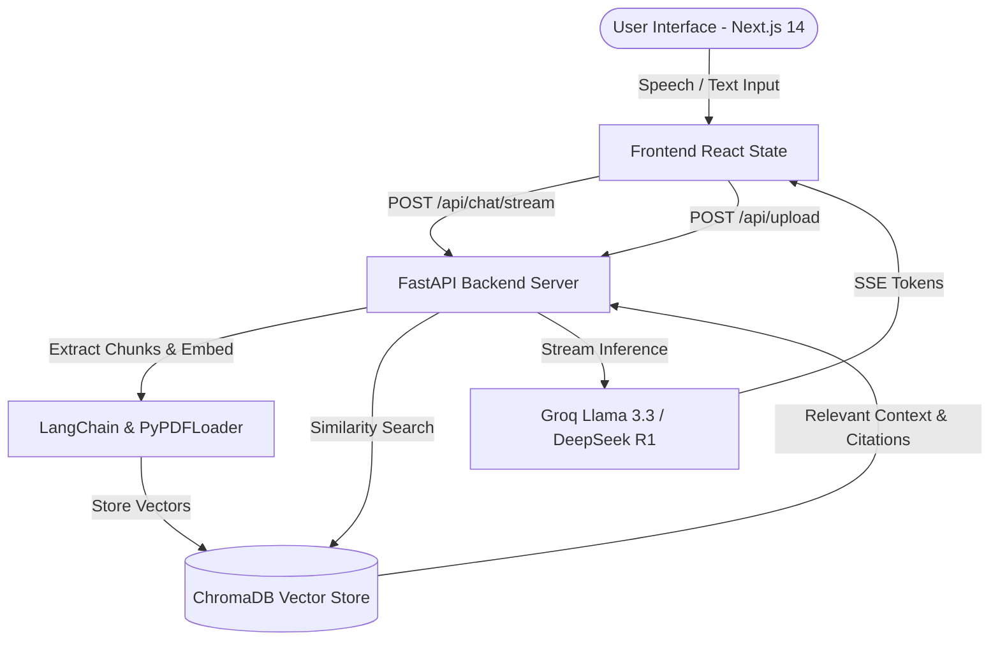

# 🚀 PromptToLife | Enterprise Multimodal RAG Assistant


**PromptToLife** is a state-of-the-art, enterprise-grade AI Knowledge Assistant powered by ultra-low-latency **Groq AI inference**, **LangChain RAG document intelligence**, **ChromaDB vector embeddings**, and a **Next.js 14 glassmorphism interface**.

---

## 🌟 Key Features

- **⚡ Real-Time Token Streaming**: Server-Sent Events (SSE) stream responses token-by-token with zero buffering.
- **📚 PDF Knowledge RAG**: Upload PDF documents to generate vector embeddings (`all-MiniLM-L6-v2`) with page-precise grounded citations.
- **📊 Auto Executive Summaries**: Ingested PDFs automatically generate a 3-bullet executive summary using Groq LLMs.
- **🤖 Multi-Model Selector**: Dynamically switch between **Llama 3.3 70B**, **DeepSeek R1**, **Llama 3.1 8B**, and **Mixtral 8x7B**.
- **🎙️ Voice Input (Speech-to-Text)**: Speak your prompts directly using browser Web Speech API.
- **🔊 Text-to-Speech (Read Aloud)**: Listen to AI responses with Web Speech Synthesis.
- **📖 In-App PDF Preview Drawer**: Click page citation tags (`[Source (Page X)]`) to preview document pages inside an embedded drawer.
- **💾 Session Memory & Persistence**: LocalStorage multi-turn conversation memory with history sidebar.
- **📥 1-Click Chat Export**: Download complete chat transcripts as formatted `.md` Markdown files.

---

## 🏗️ Architecture



---

## 🛠️ Tech Stack

### Frontend
- **Framework**: Next.js 14 (App Router, Client Components)
- **Styling**: Tailwind CSS, Vanilla CSS Glassmorphism
- **Icons**: Lucide React Icons
- **Markdown & Code**: `react-markdown`, `remark-gfm`
- **Effects**: `canvas-confetti`

### Backend
- **Framework**: FastAPI, Uvicorn, Pydantic
- **AI Inference Engine**: Groq Cloud Python SDK (`llama-3.3-70b-versatile`, `deepseek-r1-distill-llama-70b`, `llama-3.1-8b-instant`, `mixtral-8x7b-32768`)
- **Orchestration & Vector Store**: LangChain, ChromaDB, Sentence Transformers (`all-MiniLM-L6-v2`)
- **PDF Processing**: `pypdf`, `PyPDFLoader`, `RecursiveCharacterTextSplitter`
- **Streaming**: `sse-starlette`, `StreamingResponse`

---

## 🚀 Quickstart Guide

### Prerequisites
- Node.js v18+
- Python 3.10+
- Groq API Key ([console.groq.com](https://console.groq.com))

---

### 1. Backend Setup

```bash
cd backend

# Create virtual environment (optional)
python -m venv venv
source venv/bin/activate  # On Windows: venv\Scripts\activate

# Install dependencies
pip install fastapi uvicorn pydantic python-dotenv chromadb langchain langchain-community sentence-transformers pypdf groq python-multipart sse-starlette

# Create backend/.env file
echo "GROQ_API_KEY=gsk_your_groq_api_key_here" > .env

# Run FastAPI server
python -m uvicorn main:app --host 0.0.0.0 --port 8000
```

FastAPI server runs on **`http://localhost:8000`**.

---

### 2. Frontend Setup

```bash
cd frontend

# Install dependencies
npm install

# Run Next.js dev server
npm run dev
```

Next.js frontend runs on **`http://localhost:3000`**.

---

## 📡 API Reference

| Endpoint | Method | Description |
| :--- | :--- | :--- |
| `/health` | `GET` | Health check endpoint returning `{"status": "ok"}` |
| `/api/upload` | `POST` | Ingests PDF file, splits chunks, indexes into ChromaDB & triggers auto-summary |
| `/api/summary/{filename}` | `GET` | Fetches auto-generated executive summary for uploaded PDF |
| `/api/chat/stream` | `POST` | Real-time SSE token streaming with document context & conversation history |
| `/files/{filename}` | `GET` | Serves uploaded PDF files for in-app previewing |

---

## 🛡️ Security & Environment Variables

- `.env` files are ignored by git (`.gitignore`).
- Frontend automatically points to `process.env.NEXT_PUBLIC_BACKEND_URL || 'http://localhost:8000'`.
- Backend uses `os.getenv("GROQ_API_KEY")` with dynamic fallback routing to prevent 404 errors.

---

## 📜 License

Distributed under the MIT License. See `LICENSE` for more information.
